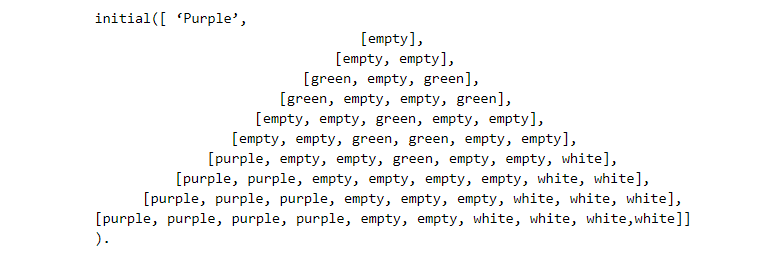
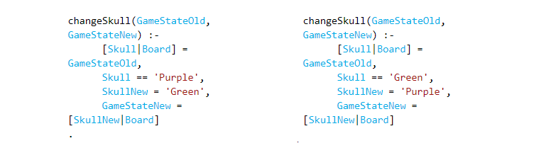
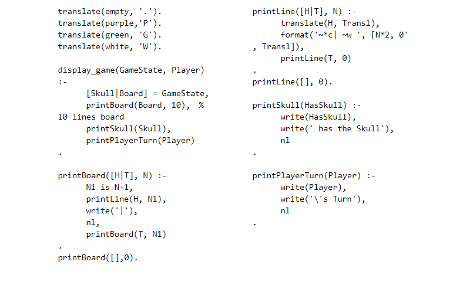

# **Green Skull**

### **Introdução**

No âmbito da unidade curricular Programação em Lógica do MIEIC, foi nos apresentado o desafio de desenvolver um jogo de tabuleiro para duas pessoas na linguagem de programação Prolog. O nosso grupo optou por implementar o jogo *Green Skull*. O jogo é da autoria de Danny Goodisman e Nestorgames é o nome da empresa que distribui o jogo.

### **O Jogo**

*Green Skull* joga-se em cima de um tabuleiro triangular equilátero composto por hexágonos. Tal como a figura mostra, o triângulo tem 10 hexágonos nas extremidades do triângulo.
As peças brancas pertencem ao primeiro jogador e as peças roxas ao segundo. As peças verdes são denominadas por zombies e o controlo sobre estas peças é de quem tiver a caveira verde.

Inicialmente, o estado do jogo deverá ser o que está indicado pela figura 1. A caveira começa por pertencer ao jogador roxo.

O *Green Skull* funciona por turnos, em que um jogador move uma peça da sua cor por jogada. Os movimentos podem ser feitos para qualquer espaço livre adjacente, ou então, se possível, pode-se eliminar uma peça. Para uma peça “comer” outra peça, a primeira peça deve saltar em linha reta por cima da segunda peça. É possível eliminar mais que uma peça numa única jogada e também uma peça eliminar outra da mesma cor (Fig. 2).

Como já foi proferido, a caveira verde dá o controlo sobre os zombies a que tiver a sua posse. A posse da caveira muda de jogador sempre o que seu dono temporário eliminar uma peça.

O objetivo do jogo para um jogador é alcançar mais pontos que o seu adversário. Para tal deve chegar com o maior número de peças da sua cor ao lado oposto do tabuleiro, ou então fazer com que no decorrer do jogo se tenha eliminado o maior número de peças que não pertençam ao jogador. Chegar ao lado oposto do tabuleiro pontua 2 pontos, enquanto que uma peça “comida” que não pertença ao jogador vale 1 ponto.

O jogo termina quando todas as peças ainda em jogo de um jogador alcancem o lado oposto do tabuleiro, ou quando todas as peças de uma cor tenham sido eliminadas. No final do jogo faz-se a contagem dos pontos e determina-se quem é o vencedor. Note-se que também é possível que os zombies ganhem o jogo.

### **Modelação programática do jogo**

#### **Representação do estado do jogo**

O estado do jogo é representado em Prolog por uma lista de 10 listas, em que o tamanho das “sub-listas” vai aumentando de tamanho. Uma peça verde é identificada pelo átomo “green”, uma roxa pelo átomo “purple” e uma branca pelo átomo “white”. Uma célula vazia é identificada pelo átomo “white”.

Por sua vez, a posse da caveira é representada pelo predicado dinâmico skull/1. Basta declararmos o estado inicial da caveira (inicialmente a caveira está na posse do jogador roxo), e com o predicado changeSkull/1 alteramos o estado da caveira. Para indicar quem deve jogar, implementamos o predicado turn/1 na mesma linha de pensamento que o da posse da caveira. Segue-se o código utilizado para implementar a representação da posse da caveira. A representação do turno é feita de forma muito semelhante.  

#### **Desenho do jogo no ecrã**

Para representar o jogo implementamos o predicado display_game/2. Este predicado chama os predicados printBoard/2 e printSkull/1 que imprimem o tabuleiro e a informação sobre a posse da caveira.

O código no qual se implementa o desenho do jogo é o seguinte:  
 
