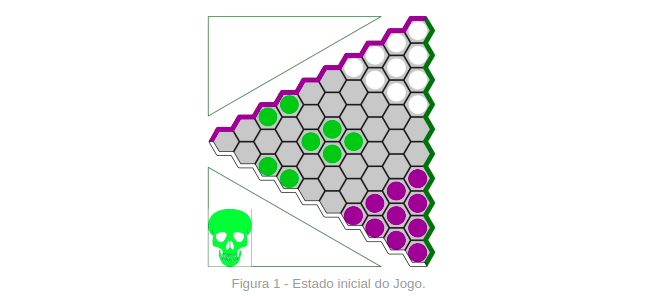
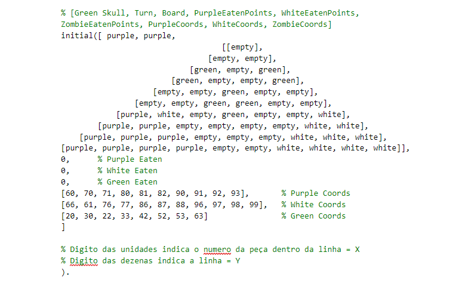
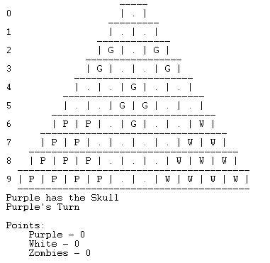
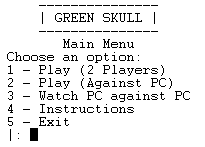

# **Green Skull**
## **Grupo - Green_Skull_2**
Diogo Miguel Borges Gomes - up201806572

João Castro Pinto - up201806667

# **Introdução**
No âmbito da unidade curricular Programação em Lógica do MIEIC, foi nos apresentado o desafio de desenvolver um jogo de tabuleiro para duas pessoas na linguagem de programação Prolog. O nosso grupo optou por implementar o jogo *Green Skull*. O jogo é da autoria de Danny Goodisman e Nestorgames é o nome da empresa que distribui o jogo.

# **O Jogo**
*Green Skull* joga-se em cima de um tabuleiro triangular equilátero composto por hexágonos. Tal como a figura mostra, o triângulo tem 10 hexágonos nas extremidades do triângulo.
As peças brancas pertencem ao primeiro jogador e as peças roxas ao segundo. As peças verdes são denominadas por zombies e o controlo sobre estas peças é de quem tiver a caveira verde. O primeiro turno pertence ao jogador roxo.



Inicialmente, o estado do jogo deverá ser o que está indicado pela figura 1. A caveira começa por pertencer ao jogador roxo.

O *Green Skull* funciona por turnos, em que um jogador move uma peça da sua cor por jogada. Os movimentos podem ser feitos para qualquer espaço livre adjacente, ou então, se possível, pode-se eliminar uma peça. Para uma peça “comer” outra peça, a primeira peça deve saltar em linha reta por cima da segunda peça. É possível eliminar mais que uma peça numa única jogada e também uma peça eliminar outra da mesma cor (Fig. 2).


Como já foi proferido, a caveira verde dá o controlo sobre os zombies a que tiver a sua posse. A posse da caveira muda de jogador sempre o que seu dono temporário eliminar uma peça.

O objetivo do jogo para um jogador é alcançar mais pontos que o seu adversário. Para tal deve chegar com o maior número de peças da sua cor ao lado oposto do tabuleiro, ou então fazer com que no decorrer do jogo se tenha eliminado o maior número de peças que não pertençam ao jogador. Chegar ao lado oposto do tabuleiro pontua 2 pontos, enquanto que uma peça “comida” que não pertença ao jogador vale 1 ponto.

O jogo termina quando todas as peças ainda em jogo de um jogador alcancem o lado oposto do tabuleiro, ou quando todas as peças de uma cor tenham sido eliminadas. No final do jogo faz-se a contagem dos pontos e determina-se quem é o vencedor. Note-se que também é possível que os zombies ganhem o jogo.

# **Lógica do Jogo**
## **Representação do Estado do Jogo**
Para representar o estado do jogo utilizamos várias informações, colocadas numa lista. Segue-se a descrição dos elementos por ordem. Note-se que nas seguintes descrições, para associar um elemento a um jogador, seja ele uma peça, um turno, ou a posse da caveira, utiliza-se os átomos *white*, *purple* e *green*.

#### Caveira
O jogador que tem posse da caveira está representado no primeiro elemento da lista. Tal como foi apresentado acima, a troca de posse da caveira acontece quando quem tiver a sua posse efetuar uma captura.

#### Turno
O turno do jogador atual é representado no segundo elemento da lista, utilizando os predicados *white* ou *green*.

#### Tabuleiro
O tabuleiro do jogo é representado por uma lista de 10 listas, em que o tamanho das “sub-listas” vai aumentando de tamanho(1-10). Uma peça verde é identificada pelo átomo “green”, uma roxa pelo átomo “purple” e uma branca pelo átomo “white”. Uma célula vazia é identificada pelo átomo “white”.

#### Peças Comidas
A seguir à representação do tabuleiro, colocamos o número de peças comidas de cada cor para aumentar a eficiência do calculo da pontuação de um estado de jogo/jogada. A ordem é as peças roxas, seguidas das brancas, seguidas das verdes.

#### Coordenadas das peças
Por último colocamos 3 listas que nos indicam em formas de coordenadas as posições das peças de forma a conseguir fazer melhores verificações às jogadas no tabuleiro. Uma coordenada é um número em que o primeiro digito representa o número da linha(contando de cima para baixo) e o segundo o "indíce" do peça na sua linha. A ordem é as peças roxas, seguidas das brancas, seguidas das verdes.




## **Desenho do Jogo no Ecrã**
#### Jogo
Para representar o jogo implementamos o predicado display_game/2. Este predicado chama os predicados *printBoard*/2, *printSkull*/1, *printPlayerTurn*/1 e *printPlayerPoints*/1, que imprimem o tabuleiro, o jogador que tem a posse da caveira, o jogador que deve jogar e os pontos das 3 equipas, respetivamente. Todos estes predicados tiram partido dos predicados *write* e *format* de forma a criarem uma interface gráfica apresentável. Repare-se que para mostrar os pontos a cada jogada, efetuamos o seu cálculo no predicado *printPlayerPoints*.



#### Menu
Uma das funcionalidades que decidimos adicionar, em relação à primeira entrega, foi um sistema de menus. Ao iniciar o jogo somos levados para o seguinte menu:



A interface com o menu é feita, escrevendo o número da opção pretendida seguido de um "enter".  Segue-se as explicações de cada opção:
1. Inicia um jogo entre dois jogadores reais;
2. Inicia um jogo entre um jogador real e o computador;
3. Inicia um jogo entre dois computadores;
4. Imprime as instruções para jogar o jogo;
5. Terminar o programa.

## Lista de Jogadas Válidas
No nosso programa, uma jogada em que uma peça não faz nenhuma captura é representada por uma lista de 3 elementos, seguindo a seginte estrutura: ```
[move, CoordenadaInicial, CoordenadaFinal]```. A representação de uma captura é feita de forma semelhante. Segue a forma seguinte: ```[capture, CoordenadaInicial, CoordenadaFinal, ListaComCapturasSeguidas]```. O último parâmetro é uma lista com as capturas possíveis fazer a partir do ponto final. Esta última lista permite-nos fazer da captura uma estrutura recursiva, facilitando-nos o cálculo das múltiplas capturas válidas.

Para verificarmos uma jogada utilizamos o predicado *valid_moves/3*, que retorna todas as jogadas válidas a partir de um certo estado de jogo para um jogador. Assim, conseguimos verificar se a jogada se encontra na lista retornada pelo predicado.

Simplificadamente, o predicado funciona da seguinte forma: começa por verficar de que jogador é a jogada e determina quais são as peças que o jogador pode mexer e para onde as pode mexer.  Após ter calculado as jogadas que apenas as peças se mexem, procedemos ao cálculo das capturas válidas a partir do predicado *valid_captures/3*. Repare-se que o nosso tem a particularidade de poder haver capturas múltiplas numa jogada. Para tratar esses casos recorremos ao predicado *valid_multiCaptures/4*, que trata de determinar recursivamente, quais as capturas possíveis de fazer a partir de cada uma captura válida, tirando partido da estrutura recursiva das capturas explicada no primeiro parágrafo desta secção. Sempre que uma nova captura é descoberta, o predicado *valid_multiCaptures* é chamado sobre essa.

## Execução de uma Jogada
A execução de uma jogada no nosso programa é feita com recurso ao predicado *move*, que recebe um estado de jogo atual, uma jogada e retorna um novo estado de jogo. Este predicado tem duas vairantes: uma para quando recebe um movimento e outra para quando recebe uma captura. 

#### Movimento
Quando é recebido um movimento apenas temos de colocar o átomo *empty* no local inicial da peça no tabuleiro e colocar o átomo que estava na posição inicial na posição final. Também precisamos de atualizar a coordenada da peça na lista de coordenadas do estado de jogo.

#### Captura
Ao receber uma captura, o predicado *move* faz o movimento da peça capturante para a sua posição final e elimina a peça capturada do tabuleiro. Quanto às coordenadas, tem de atualizar a coordenada da peça capturante e apagar a coordenada da peça capturada.

## Final do Jogo
Para verificar se o jogo terminou, decidimos implementar o predicado *game_over/2*, que recebe um estado de jogo e retorna o vencedor desse jogo se houver. Note-se que este predicado falha se o jogo terminar e sucede se não tiver terminado. 

Começa por contar o número de peças de cada equipa no extremo oposto do tabuleiro ao local de partida. Com esse número para cada equipa, pode calcular a pontuação total de cada equipa, sendo que o número de peças comidas de cada equipa está acessível no estado de jogo. A forma como as equipas pontuam está descrita na secção [O Jogo](#o-jogo). Tendo a pontuação de cada equipa, conseguimos saber que equipa é vencedora.

Quanto às verificações para verificar se o jogo terminou, verifica se o número de peças de alguma equipa é igual a 0 e se todas as peças restantes de uma equipa se encontram num dos extremos opostos à posição de partida dessa equipa. Se alguma destas condições se verificar o predicado falha, caso contrario, sucede.

## Avaliação do Estado de Jogo
A avaliação de um estado de jogo é feita com recurso ao predicado *value/3*, que recebe um estado de jogo, um jogador e retorna um valor que representa a pontuação do jogador no estado de jogo. A nossa implementação deste predicado tem algumas semelhanças com o cálculo de cada pontuação de cada jogador no predicado *game_over*. Dependendo para que jogador queremos calcular o valor do tabuleiro, buscamos a sua pontuação, ou seja, o número de peças das outras equipas comidas a somar com o número das suas peças que estão no respetivo extremo que lhe faz pontuar a multiplicar por 2.

## Jogada do Computador
Uma outra funcionalidade do nosso jogo é a possibilidade de jogar contra o computador e assistir a um jogo que o computador controla as peças brancas e as peças roxas. Para esta nova funcionalidade, foi necessário implementar um predicado (*choose_move/4*) que escolha uma jogada a fazer pelo computador de acordo com alguns critérios, variando a dificuldade.

#### **Critério Aleatório**
A dificuldade de jogo mais baixa implementada, recorre à seleção aleatória de uma jogada válida entre as jogadas retornadas por uma chamada ao predicado *valid_moves/3*. Estamos cientes de que por ser um critério aleatório, existe a probabilidade deste nível de dificuldade ser muito elevado, mas consideramos que esta probabilidade é diminuta. **Note-se que neste modo desativamos a capacidade do computador fazer capturas múltiplas.**

#### Critério do Valor do Estado de Jogo resultante
Este nível de dificuldade verfica qual das jogadas válidas determinadas pelo predicado *valid_moves/3* resulta num estado de jogo mais favorável à equipa do computador. Para este efeito, simulamos cada jogada válida num estado de jogo temporário e associamos a pontuação do jogador no novo estado jogo a cada jogada válida. Com esta associação conseguimos fazer uma ordenação com base na pontuação que cada jogada traz ao jogador/computador. Tendo a ordenação feita, basta retornarmos a jogada válida com maior pontuação associada. Repare-se que neste modo de jogo permitimos o computador decidir se lhe é benéfico efetuar capturas múltiplas e quais capturas mútliplas fazer. Geralmente, o computador vai optar por efetuar uma captura válida, uma vez que aumenta a sua pontuação no próximo estado de jogo.

# Conclusão
Tanto quanto sabemos, o programa não tem erros e todas as funcionalidades enunciadas aqui estão funcionais.

Uma melhoria interessante de fazer ao nosso jogo seria implementar um modo de jogo entre duas pessoas em dois computadores diferentes. Implementar uma sugestão de jogadas é um possível melhoramento menos ambicioso, mas também muito interessante.

Este trabalho permitiu-nos efetivamente colocar os nossos conhecimentos de *prolog* à prova, na medida em que fomentou várias discussões entre nós sobre a matéria, que nos fez aprofundar o conhecimento sobre *prolog*.

# Bibliografia
- SWI-Prolog Documentation, 2016, Acedido a 28/11/2020, [https://www.swi-prolog.org/](https://www.swi-prolog.org/)
- SICStus Prolog User’s Manual, April 2020, Acedido a 28/11/2020, [https://sicstus.sics.se/sicstus/docs/latest4/pdf/sicstus.pdf](https://sicstus.sics.se/sicstus/docs/latest4/pdf/sicstus.pdf)


